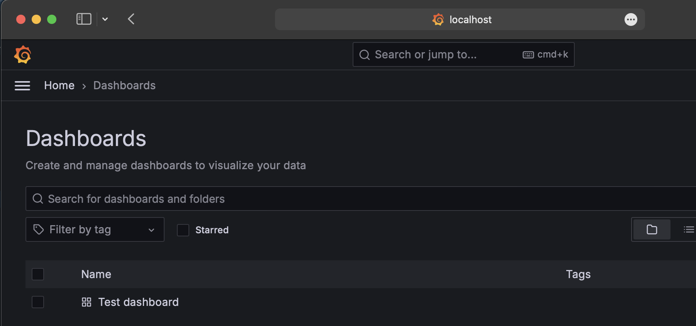
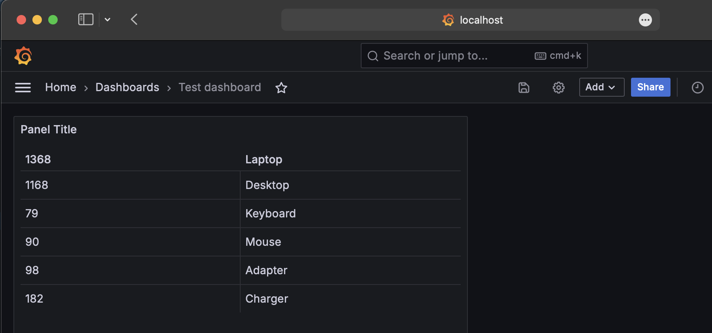

# Grafana PoC

This repository has a simple docker compose file that brings up grafana in a docker container,
loads a test dashboard and test datasource. It uses CSV plugin which is installed using 
the `GF_INSTALL_PLUGINS` environment variable. This is ideal set up for a PoC.

Similarly alerts can be provisioned using [configuration file](https://grafana.com/docs/grafana/latest/alerting/set-up/provision-alerting-resources/file-provisioning/).

## Prerequisites
* Docker / Docker Desktop
* Docker Compose

## Run grafana from local machine
Clone the repo:
```
git clone https://github.com/bheesma/tinker-grafana.git
cd tinker-grafana
```
Start the grafana container
```
docker-compose up -d
```
## Access Grafana
* Visit http://localhost:3000
* Login with admin:admin and change the password

## Troubleshooting
* Sometimes the volumes mounted to docker container just hangs indefinitely and the dashboards do not load. This was solved
simply by updating to latest docker desktop. The docker compose version was `v2.27.1-desktop.1`

## Screenshots
Test Dashboard loaded from config file:


Dashboard showing the data from CSV:


## Future Improvements/Proof of concept
* Use Kustomize or Helm to provision Grafana - https://grafana.github.io/grafana-operator/docs/installation/helm/
